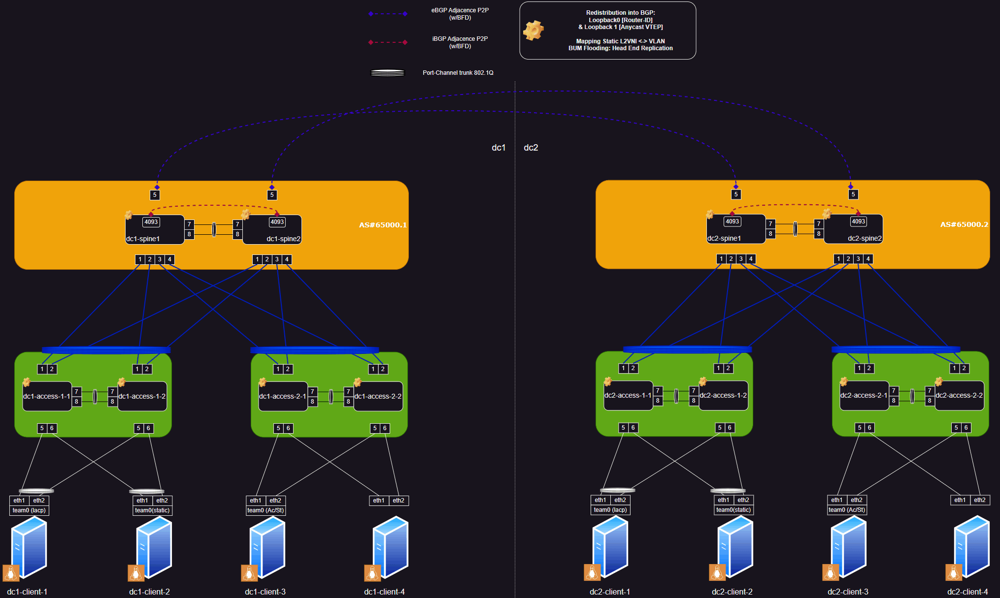

<head>
  <link rel="stylesheet" href="css/animated-gif.css">
</head>

# Arista Lab Dual Site CE Datacenter with VxLAN DCI

This lab is intended as a training to mount an Arista lab with [containerlab](https://containerlab.dev/). 
At the time of this writing Arista provides great VxLAN MP-BGP EVPN examples with [Arista Validated Design aka. "AVD"](https://avd.arista.com). 
This example is a special case not covered with AVD examples derived from this whitepaper [Data Center Interconnection with VXLAN](https://www.arista.com/assets/data/pdf/Whitepapers/Arista_Design_Guide_DCI_with_VXLAN.pdf). 

*    Dual sites DataCenter with VxLAN DCI Technology

It demonstrates the ability to implement and manage all kinds of designs through avd. 

Each site is in 802.3 classical Ethernet with MLAG configured at the core and access layer (kind of L2LS in Arista naming). 
Also, the 2 sites are interconnected with two Layer-3 point-to-point links, and eBGP adjacencies on top of it (using BFD) to propagate VTEP IPv4 anycast address information. 
All vlans are extended via VxLAN through core switches configured in MLAG with VxLAN HER aka. "Head End Replication" to replicate BUM traffic over vxlan (flooding behavior). 

Setup the lab, please follow this link [Lab Setup](Setup.md)

Deploy the lab, please follow this link [Lab Deployment](Deployment.md)

You will be able to retrieve all infrastructure documentation once the lab will be deployed in the documentation folder, thanks to AVD !

To be able to test the connectivity, 4 clients are implemented in multiple connectivity design options in each DC: 

  * dcX-client-1: LAg with LACP 
  * dcX-client-2: LAg with static bundling 
  * dcX-client-3: 2 Ethernets port with Active/Standby settings 
  * dcX-client-4: 2 Standalone connection 

Clients are Alpine docker hosts and are provided with iperf2 and iperf3 to be able to do some network and redundancy testing once lab is deployed. 
Some ipv4 configuration have been inserted in each client to test on the fly the lab.

| DC Name | Hostname | Interface | Intf Mode | Vlan | IPv4/v6 Address |
| :--- | :--- | :--- | ---: | ---: | ---: |
| DC1 | `clab-cevxlandci-dc1-access1-1` | team0 | Trunk 802.1Q | 10 | 66.10.0.1/24 |
| DC1 | `clab-cevxlandci-dc1-access1-1` | team0 | Trunk 802.1Q | 20 | 66.20.0.1/24 |
| DC1 | `clab-cevxlandci-dc1-access1-1` | team0 | Trunk 802.1Q | 30 | 66.30.0.1/24 |
| DC1 | `clab-cevxlandci-dc1-access1-1` | team0 | Trunk 802.1Q | 40 | 66.40.0.1/24 |
| DC1 | `clab-cevxlandci-dc1-access1-2` | team0 | Trunk 802.1Q | 10 | 66.10.0.2/24 |
| DC1 | `clab-cevxlandci-dc1-access1-2` | team0 | Trunk 802.1Q | 20 | 66.20.0.2/24 |
| DC1 | `clab-cevxlandci-dc1-access1-2` | team0 | Trunk 802.1Q | 30 | 66.30.0.2/24 |
| DC1 | `clab-cevxlandci-dc1-access1-2` | team0 | Trunk 802.1Q | 40 | 66.40.0.2/24 |
| DC1 | `clab-cevxlandci-dc1-access1-3` | team0 | Trunk 802.1Q | 10 | 66.10.0.3/24 |
| DC1 | `clab-cevxlandci-dc1-access1-3` | team0 | Trunk 802.1Q | 20 | 66.20.0.3/24 |
| DC1 | `clab-cevxlandci-dc1-access1-3` | team0 | Trunk 802.1Q | 30 | 66.30.0.3/24 |
| DC1 | `clab-cevxlandci-dc1-access1-3` | team0 | Trunk 802.1Q | 40 | 66.40.0.3/24 |
| DC1 | `clab-cevxlandci-dc1-access1-3` | team0 | Trunk 802.1Q | 40 | 66.40.0.3/24 |
| DC1 | `clab-cevxlandci-dc1-access1-3` | eth1 | Access | 40 | 66.40.0.4/24 |
| DC2 | `clab-cevxlandci-dc2-access1-1` | team0 | Trunk 802.1Q | 10 | 66.10.0.251/24 |
| DC2 | `clab-cevxlandci-dc2-access1-1` | team0 | Trunk 802.1Q | 20 | 66.20.0.251/24 |
| DC2 | `clab-cevxlandci-dc2-access1-1` | team0 | Trunk 802.1Q | 30 | 66.30.0.251/24 |
| DC2 | `clab-cevxlandci-dc2-access1-1` | team0 | Trunk 802.1Q | 40 | 66.40.0.251/24 |
| DC2 | `clab-cevxlandci-dc2-access1-2` | team0 | Trunk 802.1Q | 10 | 66.10.0.252/24 |
| DC2 | `clab-cevxlandci-dc2-access1-2` | team0 | Trunk 802.1Q | 20 | 66.20.0.252/24 |
| DC2 | `clab-cevxlandci-dc2-access1-2` | team0 | Trunk 802.1Q | 30 | 66.30.0.252/24 |
| DC2 | `clab-cevxlandci-dc2-access1-2` | team0 | Trunk 802.1Q | 40 | 66.40.0.252/24 |
| DC2 | `clab-cevxlandci-dc2-access1-3` | team0 | Trunk 802.1Q | 10 | 66.10.0.253/24 |
| DC2 | `clab-cevxlandci-dc2-access1-3` | team0 | Trunk 802.1Q | 20 | 66.20.0.253/24 |
| DC2 | `clab-cevxlandci-dc2-access1-3` | team0 | Trunk 802.1Q | 30 | 66.30.0.253/24 |
| DC2 | `clab-cevxlandci-dc2-access1-3` | team0 | Trunk 802.1Q | 40 | 66.40.0.253/24 |
| DC2 | `clab-cevxlandci-dc2-access1-3` | team0 | Trunk 802.1Q | 40 | 66.40.0.253/24 |
| DC2 | `clab-cevxlandci-dc2-access1-3` | eth1 | Access | 40 | 66.40.0.254/24 |
